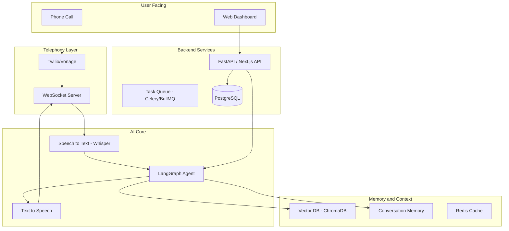
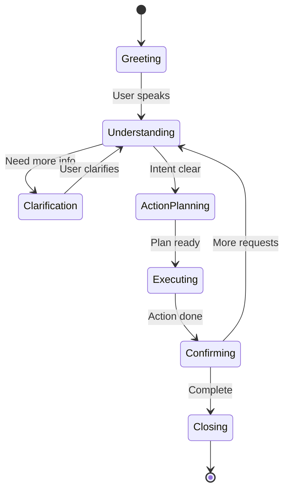

# AI Agentic Calling Solution - Learning & Building Plan

Based on your GitHub profile, you have strong TypeScript/JavaScript, Next.js, and Node.js skills with CI/CD exposure. This plan leverages your existing expertise while introducing AI/ML concepts progressively.

---

## Phase 1: AI Foundations (Weeks 1-3)

### Week 1: Core AI/ML Concepts

**Learning:**

- Understand LLMs (Large Language Models) - how they work, tokens, context windows, temperature
- Learn about embeddings and vector databases
- Study prompt engineering fundamentals

**Resources (Free):**

- [DeepLearning.AI Short Courses](https://www.deeplearning.ai/short-courses/) - Free LangChain courses
- [Anthropic Prompt Engineering Guide](https://docs.anthropic.com/claude/docs/prompt-engineering)
- YouTube: 3Blue1Brown Neural Networks series

**Hands-on Project:**

Build a simple CLI chatbot using OpenAI-compatible APIs with [Ollama](https://ollama.ai/) (free, runs locally)

### Week 2: LangChain Fundamentals

**Learning:**

- LangChain architecture: Chains, Prompts, Models, Memory
- Document loaders, text splitters
- Output parsers and structured outputs

**Resources:**

- [LangChain Documentation](https://python.langchain.com/docs/)
- [LangChain.js Documentation](https://js.langchain.com/docs/) (use this given your TypeScript background)

**Hands-on Project:**

Build a document Q&A system that can answer questions from PDFs using:

- Ollama or Groq (free tier) for LLM
- ChromaDB (free) for vector storage

### Week 3: LangGraph & Agentic Systems

**Learning:**

- What are AI Agents vs simple chains
- LangGraph: State machines, nodes, edges, conditional routing
- Multi-agent architectures
- Tool calling and function calling

**Resources:**

- [LangGraph Documentation](https://langchain-ai.github.io/langgraph/)
- [LangGraph Academy](https://academy.langchain.com/) (free courses)

**Hands-on Project:**

Build a multi-step agent that can:

- Search the web (using Tavily free tier)
- Take notes
- Make decisions based on information gathered

---

## Phase 2: Voice & Telephony Fundamentals (Weeks 4-6)

### Week 4: Speech Technologies

**Learning:**

- Text-to-Speech (TTS) systems
- Speech-to-Text (STT) / Automatic Speech Recognition (ASR)
- Real-time audio streaming concepts
- WebRTC basics

**Free/Open Source Tools:**

| Category | Tool | Notes |

|----------|------|-------|

| STT | Whisper (OpenAI) | Free, open source, runs locally |

| STT | Deepgram | Free tier available |

| TTS | Coqui TTS | Open source |

| TTS | ElevenLabs | Free tier for prototyping |

| TTS | Piper | Fully open source |

**Hands-on Project:**

Build a voice transcription app using Whisper locally

### Week 5: Telephony Systems

**Learning:**

- VoIP (Voice over IP) fundamentals
- SIP (Session Initiation Protocol) basics
- Telephony providers and their APIs
- Call flows and audio codecs

**Free/Low-Cost Options:**

| Provider | Free Tier | Notes |

|----------|-----------|-------|

| Twilio | $15 credit | Industry standard, great docs |

| Vonage | $10 credit | Alternative option |

| Plivo | Free trial | Budget-friendly |

| FreePBX | Free | Self-hosted option |

**Hands-on Project:**

Set up a basic IVR (Interactive Voice Response) using Twilio's free credit

### Week 6: Real-time Audio Processing

**Learning:**

- WebSockets for real-time communication
- Audio streaming protocols
- Handling latency in voice applications
- Interruption handling

**Hands-on Project:**

Build a real-time voice chat application with:

- Browser microphone input
- WebSocket streaming to backend
- Whisper transcription
- TTS response playback

---

## Phase 3: Building the Core Product (Weeks 7-10)

### Architecture Overview



### Week 7: Project Setup & Core Architecture

**Tasks:**

1. Set up monorepo structure
2. Initialize TypeScript/Next.js frontend
3. Set up Python backend (FastAPI) for AI components
4. Configure Docker development environment

**Tech Stack (Free/Open Source):**

```
Frontend:        Next.js 14+ (App Router)
Backend:         FastAPI (Python) + Node.js services
AI Framework:    LangChain/LangGraph
LLM:             Ollama (local) / Groq (free tier) / Together.ai (free tier)
STT:             Whisper (local) or Deepgram (free tier)
TTS:             Piper (open source) or ElevenLabs (free tier)
Vector DB:       ChromaDB or Qdrant (free)
Database:        PostgreSQL + Supabase (free tier)
Cache:           Redis (free tier on Upstash)
Telephony:       Twilio (free credit to start)
```

### Week 8: Voice Pipeline Implementation

**Build:**

1. Twilio webhook handlers for incoming calls
2. Real-time audio streaming via WebSocket
3. Whisper integration for transcription
4. TTS pipeline for responses

**Key Files to Create:**

- `backend/voice/call_handler.py` - Handle incoming calls
- `backend/voice/audio_stream.py` - WebSocket audio streaming
- `backend/voice/transcription.py` - Whisper integration
- `backend/voice/synthesis.py` - TTS integration

### Week 9: LangGraph Agent for Conversations

**Build:**

1. Conversational agent with LangGraph
2. Define agent states (greeting, inquiry, action, closing)
3. Tool integrations (calendar, CRM, database lookup)
4. Memory management for conversation context

**Agent State Machine:**



### Week 10: Frontend Dashboard

**Build:**

1. Call history and analytics dashboard
2. Real-time call monitoring
3. Agent configuration interface
4. Prompt/script management

---

## Phase 4: Advanced Features & MLOps (Weeks 11-14)

### Week 11: RAG (Retrieval Augmented Generation)

**Learning:**

- Advanced chunking strategies
- Hybrid search (keyword + semantic)
- Reranking and relevance scoring

**Build:**

- Knowledge base for the calling agent
- Document ingestion pipeline
- Context retrieval during calls

### Week 12: Evaluation & Testing

**Learning:**

- LLM evaluation metrics
- A/B testing for prompts
- Conversation quality scoring

**Tools (Free):**

- LangSmith (free tier) for tracing
- Ragas for RAG evaluation
- Custom evaluation scripts

### Week 13: MLOps Fundamentals

**Learning:**

- Model versioning and deployment
- Monitoring LLM applications
- Handling failures and fallbacks
- Cost optimization

**Free MLOps Tools:**

| Tool | Purpose |

|------|---------|

| MLflow | Experiment tracking |

| Weights & Biases | Free tier monitoring |

| LangSmith | LLM tracing |

| Prometheus + Grafana | Metrics |

### Week 14: Scaling & Production Prep

**Learning:**

- Load balancing voice applications
- Queue-based architecture for calls
- Error handling and retry logic
- Security considerations

**Build:**

- Call queue management
- Failover mechanisms
- Rate limiting
- Audit logging

---

## Phase 5: Deployment & Polish (Weeks 15-16)

### Week 15: Deployment

**Free Deployment Options:**

| Service | What to Deploy | Free Tier |

|---------|---------------|-----------|

| Vercel | Next.js frontend | Generous free tier |

| Railway | Python backend | $5 free/month |

| Render | Backend services | Free tier available |

| Fly.io | WebSocket servers | Free allowance |

| Supabase | PostgreSQL + Auth | Free tier |

| Upstash | Redis | Free tier |

**Tasks:**

1. Set up CI/CD with GitHub Actions
2. Configure production environment variables
3. Set up monitoring and alerting
4. Deploy to staging environment

### Week 16: Testing & Launch

**Tasks:**

1. End-to-end testing
2. Load testing with simulated calls
3. Documentation
4. Soft launch with beta users

---

## Key AI Terms Glossary

| Term | Definition |

| ---------------------- | ----------------------------------------------------------------- |

| **LLM** | Large Language Model - AI trained on text data |

| **Agent** | AI that can take actions and make decisions |

| **RAG** | Retrieval Augmented Generation - enhancing LLM with external data |

| **Embeddings** | Numerical representations of text for similarity search |

| **Vector DB** | Database optimized for storing and querying embeddings |

| **Prompt Engineering** | Crafting inputs to get desired LLM outputs |

| **Chain** | Sequence of LLM calls and operations |

| **Tool Calling** | LLM deciding to use external tools/APIs |

| **Context Window** | Maximum text an LLM can process at once |

| **Fine-tuning** | Training LLM on specific data for customization |

| **MLOps** | DevOps practices for ML/AI systems |

---

## Recommended Learning Resources

### Free Courses

1. **LangChain Academy** - Official free courses
2. **DeepLearning.AI** - Andrew Ng's short courses
3. **Hugging Face Course** - NLP and transformers
4. **MLOps Zoomcamp** - Free MLOps course

### Documentation

1. LangChain/LangGraph docs
2. Twilio Voice documentation
3. Whisper API documentation

### Communities

1. LangChain Discord
2. Hugging Face Discord
3. MLOps Community Slack

---

## Cost Estimation (Monthly After Free Tiers)

| Service | Estimated Cost |

| ----------------------- | -------------------------------- |

| LLM API (Groq/Together) | $0-20 (generous free tiers) |

| Twilio | ~$1/100 calls |

| Hosting | $0-10 |

| Database | $0 (free tiers) |

| **Total** | **$10-50/month for development** |

---

## Next Steps

1. **This Week:** Set up development environment with Ollama locally
2. **First Project:** Build the CLI chatbot to understand LangChain basics
3. **Join Communities:** LangChain Discord for questions and networking

Would you like me to help you set up the initial project structure in your `langchain` workspace?
